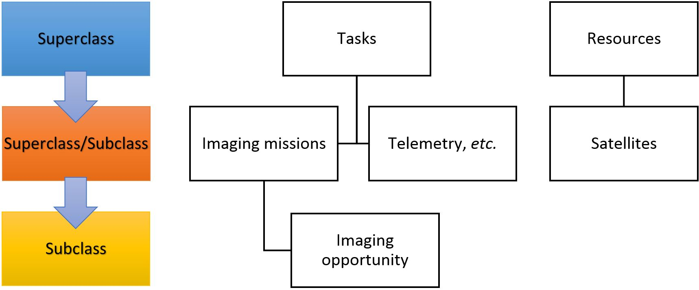
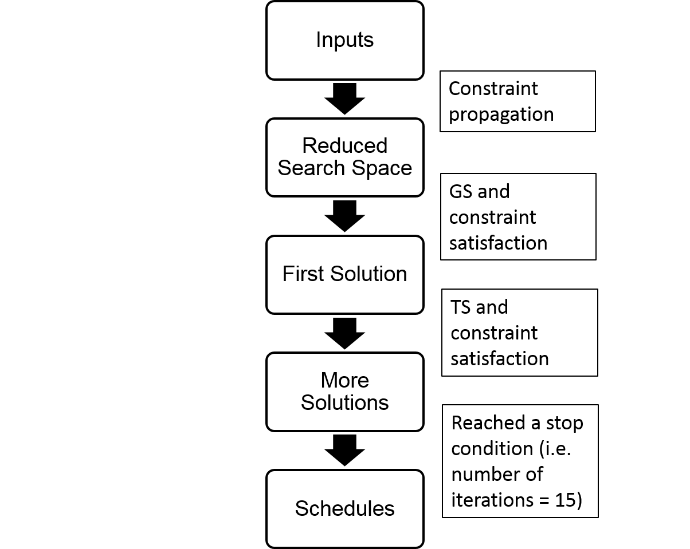
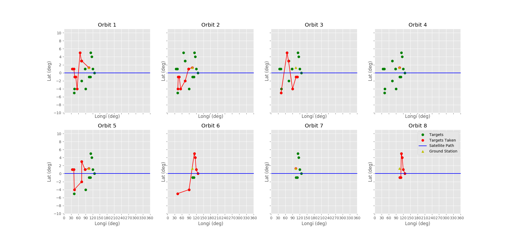

# Satellite Scheduling Problem
### Author: Tan Ren Jie
### Dated: 18 Dec 2016
Efficient satellite mission planning has always been a key aspect of the Ground Operations.  
The task of satellite mission planning has always been placed onto a human operator to plan accurately and efficiently to meet all of the requirements provided.  
This manual tasking is tedious and requires high level of meticulosity  
An automatic satellite scheduler can use Search Algorithms to optimize and quicken this process

# Problem Formulation
The scheduling problem of an earth observation satellite is a large and difficult combinatorial optimization problem.  
Thankfully, such a scheduling problem is well-studied with numerous papers stating different problem formulations.  
Some notable formulations are the generalized knapsack formulation, which is well-known to be NP-hard, adopted in [2].  
In [3], it discusses the possibility of using linear integer programming formulation with CPLEX or as a constraint satisfaction problem formulation.  
For this demo, we shall adopt a Constraint-Optimization Problem (COP) formulation using Object Oriented Programming(OOP).  

COP refers to a set of problems that requires the optimization of an objective function with respect to some variables in the presence of constraints on those variables.  

# Object Used
The objects used are summarized in the class table below.  
The classes Imaging Missions, Satellites and Ground Stations are user inputs designed by the users to fulfil the mission requirements.  
Imaging Opportunities and Downlink are derived classes which the programme would automatically generate after the users has specified the Tasks and Resources he/she wants to simulate for a given Scenario time frame.  

# Algorithm
<!--  -->

## Objective function
<!-- $$Score_i = k_a a_i + k_b b_i + k_c c_i + k_d d_i + k_e e_i$$ -->

## To run
1. Create the Resource and Imaging Mission by changing and running the creating_IM_params.py and creating_resource_params.py file (you can skip this step to run the sample simulation I have created.)
2. Open the main.py file and uncomment out the algorithm you want to use. Run it.
3. This would generate 2 .csv files per orbit (Results and Remaining targets)
4. To plot, open the subplotting.py file and change the numberOfOrbits variable to the same as the last number of the orbit.

## Plots

The Mission is simulated to complete in 8 orbits. The plot is taken in the frame with respect to the satellite orbit path.

### Mission Requirements
- 20 distinct point targets scattered at Near Equatorial Orbit.
- All to be imaged twice
- All to be imaged using an Optical Sensor
- The maximum look angle is set to be 45deg
- Priorities were set to be all equal

### Resources
- One Satellite with an Optical Sensor and a carry capacity of 8 images.
- Satellite agility was modelled have an average angular speed of 0.0628 rad/s
- One Ground Station at

# References
[1] John L. Mohammed. Spacecaps: Automated mission planning for the techsat 21 formation-
ying cluster experiment. FLAIRS-02 Proceedings, 2002.  
[2] Jin-Kao Hao Michel Vasquez. A \logic-constrained" knapsack formulation and a tabu al-
gorithm for the daily photograph scheduling of an earth observation satellite. Journal of
Computational Optimization and Applications, 2000.  
[3] J.C. Agnese N.Bataille D. Blumstein E. Bensana, G. Verfaillie. Exact and inexact methods
for the daily management of an earth observation satellite. European Space Agency, 1996.  
